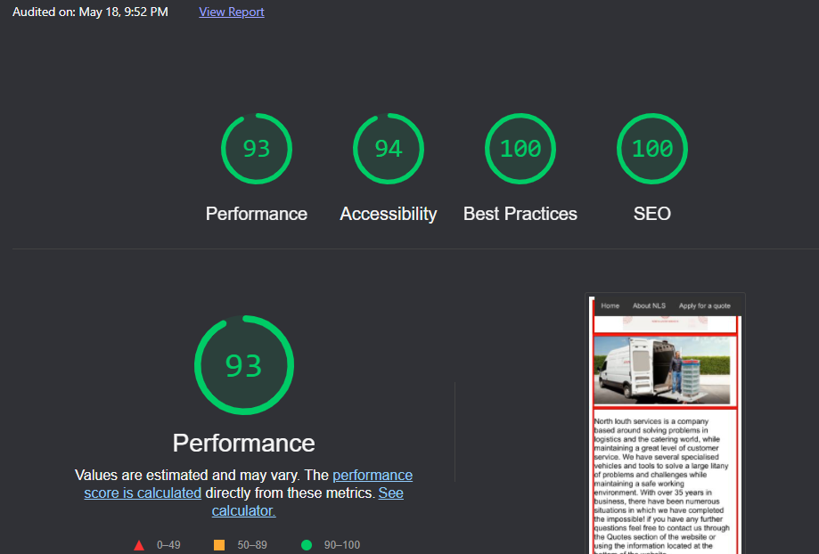
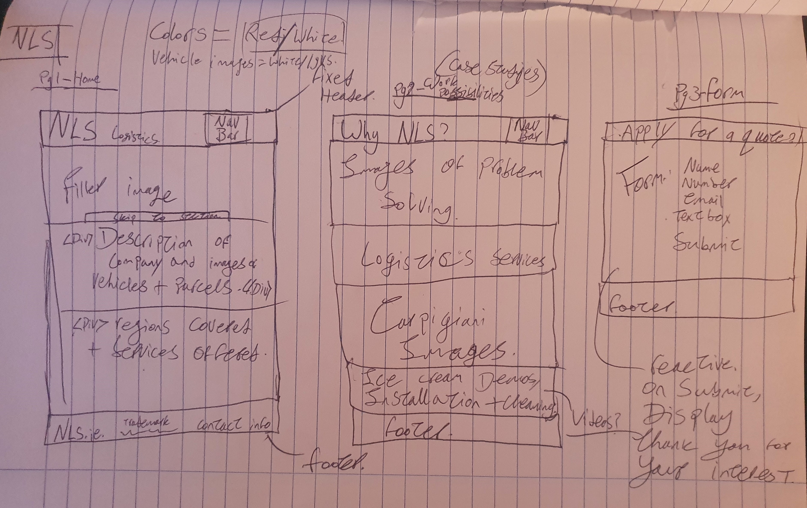

# Project-NLS
a website about north louth services, a local company in County Louth, ireland. 
I have selected this company as my project material because i have worked there for approximately 12 years and have enough knowledge on the company to avoid researching it and focusing more time on my coding. 

## UX
 
This website is aimed at users looking for a logistics or installation solution, more specifically in the realm of the food service industry. I have hoped to design a website that conveys the companies general purpose on the home page, more specific possibilities on the capabilities page and a form on the user form page to allow the user to submit their request for a quote. As you can see from the image above, the current build has deviated from my original old school pen and paper plan, to accomodate for more in depth UX.

## User Stories: 
-Customer seeking a logistics solution, navigates from home page to userform, submits their request to the website.
-User browsing the web, enters the website and understands from the home page and capabilities page that this website is for a company based around logistics problem solving.
-user trying to understand North louth services purpose, navigates through home page and capabilities page, decides whether the company meets their needs or not. 

This section is also where you would share links to any wireframes, mockups, diagrams etc. that you created as part of the design process. These files should themselves either be included as a pdf file in the project itself (in an separate directory), or just hosted elsewhere online and can be in any format that is viewable inside the browser.

## Features

-Navigation Bar: A simple static navigation bar to allow the user to access all the websites pages. 

-Interactive map Iframe: An Iframe containing a google maps extension showing the location of the related company, allows the user to interact and look around the map and nearby areas. 

-Footer: A Static footer containing information on the company, and contact information. 

-Interactive video Iframe: Iframes containing videos related to the company, allows user to play and pause the video as well as control the audio levels. 

-User form: A form which allows the user to submit information to the website to be processed into a quote, including a full name, email address, phone number and a text box for their request. 
 

### Features Left to Implement
- Some javascipt features for animation, pop ups and redirects would be a great addition. 
- A more interactive map feature allowing the user to plot a route. 

## Technologies Used

-[HTML]
Hyper text markup language used for building the websites bones so to speak. 

-[CSS]
Cascading style sheets is a language used to add style, shape and color to the website. 

## Testing
Below are some use cases i tested the sight with: 

1. Homepage interactive map:
    1. Go to the index.html page. 
    2. Scroll to the bottom of the page, try to zoom in and move the map around. 
    3. Refresh and confirm it resets position. 

2. Navigation bar and back to top button: 
    1. Go to index.html.
    2. using the nav bar, navigate through the capabilities and userform pages. 
    3. scroll to the bottom of each page and use the "top" button in the lower right, ensuring it returns you to the nav bar.

3. Interactive videos:
    1. Go to capabilities.html
    2. Confirm autoplay is off on the 3 iframe videos. 
    3. Click on each of the iframe videos and confirm they play on interact. 
    4. Click on each video again and confirm you can pause them. 

1. User form:
    1. Go to the userform.html page. 
    2. Try to submit the empty form and verify that an error message about the required fields appears
    3. Try to submit the form with an invalid email address and verify that a relevant error message appears
    4. Try to submit the form with all inputs valid and verify that a success message appears.

Site seems to work well on firefox, chrome and opera GX. Using chrome developer tools, it seems to also be functional in a mobile browser thanks to updated media queries. 

i discovered a small error in the code while testing, there was a simple image linking error occuring in the HTML which has since been solved. 

i encountered a viewport overflow issue which was linked to width issues between parent and child elements that i dug into and worked with until i solved the problem. 

## Deployment

To deploy the site i used Github pages, following githubs guide for pages set up available at https://docs.github.com/en/pages/quickstart. I launched with an existing repository so skipped the inital setup. I did not realise i was running my main project out of a branch on github so this was recently amended. 

My development version is now the 'master' branch in the project repository, there have been several changes made from this version based on well needed criticism with the current version now nested in the 'Main' branch of the repository. 

If you would like to test the site locally, Using a pull request, Download the project to your PC and arrange the files and folders as they are in the project and launch the index.html page using your preferred web browser.

## Credits
Youtube - video content and embed code
Code institute - HTML and CSS 
Google maps - Map iframe and embed code
Google images - Images
Canva.com - Creation of title image
w3chools.com - extra resources and study
stackoverflow - problem solving
### Content
- The videos for the capabilities page were found at the following links on : 
Video 1 - https://www.youtube.com/embed/r1pl5vlTOEg
Video 2 - https://www.youtube.com/embed/OZj7aX6mNqs?start=6
Video 3 - https://www.youtube.com/embed/VFBn6C2z04g?start=9

### Media
- The photos used in this site were obtained from google images.
- The title image was created using Canva.com.

### Acknowledgements

- I received inspiration for this project from my current employers company. 