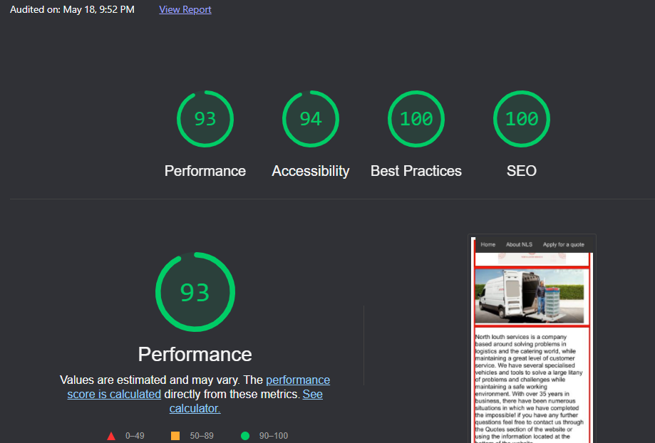

# Project-NLS
a website about north louth services, a local company in County Louth, ireland. 
I have selected this company as my project material because i have worked there for approximately 12 years and have enough knowledge on the company to avoid researching it and focusing more time on my coding. 

## UX
 
This website is aimed at users looking for a logistics or installation solution, more specifically in the realm of the food service industry. I have hoped to design a website that conveys the companies general purpose on the home page, more specific possibilities on the capabilities page and a form on the user form page to allow the user to submit their request for a quote.

User Stories: 
-Customer seeking a logistics solution, navigates from home page to userform, submits their request to the website.
-User browsing the web, enters the website and understands from the home page and capabilities page that this website is for a company based around logistics problem solving.
-user trying to understand North louth services purpose, navigates through home page and capabilities page, decides whether the company meets their needs or not. 

This section is also where you would share links to any wireframes, mockups, diagrams etc. that you created as part of the design process. These files should themselves either be included as a pdf file in the project itself (in an separate directory), or just hosted elsewhere online and can be in any format that is viewable inside the browser.

## Features

-Navigation Bar: A simple static navigation bar to allow the user to access all the websites pages. 

-Interactive map Iframe: An Iframe containing a google maps extension showing the location of the related company, allows the user to interact and look around the map and nearby areas. 

-Footer: A Static footer containing information on the company, and contact information. 

-Interactive video Iframe: Iframes containing videos related to the company, allows user to play and pause the video as well as control the audio levels. 

-User form: A form which allows the user to submit information to the website to be processed into a quote, including a full name, email address, phone number and a text box for their request. 
 

### Features Left to Implement
- Another feature idea

## Technologies Used

In this section, you should mention all of the languages, frameworks, libraries, and any other tools that you have used to construct this project. For each, provide its name, a link to its official site and a short sentence of why it was used.

- [JQuery](https://jquery.com)
    - The project uses **JQuery** to simplify DOM manipulation.

## Testing

In this section, you need to convince the assessor that you have conducted enough testing to legitimately believe that the site works well. Essentially, in this part you will want to go over all of your user stories from the UX section and ensure that they all work as intended, with the project providing an easy and straightforward way for the users to achieve their goals.

Whenever it is feasible, prefer to automate your tests, and if you've done so, provide a brief explanation of your approach, link to the test file(s) and explain how to run them.

For any scenarios that have not been automated, test the user stories manually and provide as much detail as is relevant. A particularly useful form for describing your testing process is via scenarios, such as:

1. Contact form:
    1. Go to the "Contact Us" page
    2. Try to submit the empty form and verify that an error message about the required fields appears
    3. Try to submit the form with an invalid email address and verify that a relevant error message appears
    4. Try to submit the form with all inputs valid and verify that a success message appears.

In addition, you should mention in this section how your project looks and works on different browsers and screen sizes.

You should also mention in this section any interesting bugs or problems you discovered during your testing, even if you haven't addressed them yet.

If this section grows too long, you may want to split it off into a separate file and link to it from here.

## Deployment

This section should describe the process you went through to deploy the project to a hosting platform (e.g. GitHub Pages or Heroku).

In particular, you should provide all details of the differences between the deployed version and the development version, if any, including:
- Different values for environment variables (Heroku Config Vars)?
- Different configuration files?
- Separate git branch?

In addition, if it is not obvious, you should also describe how to run your code locally.

## Credits

### Content
- The text for section Y was copied from the [Wikipedia article Z](https://en.wikipedia.org/wiki/Z)

### Media
- The photos used in this site were obtained from ...

### Acknowledgements

- I received inspiration for this project from X